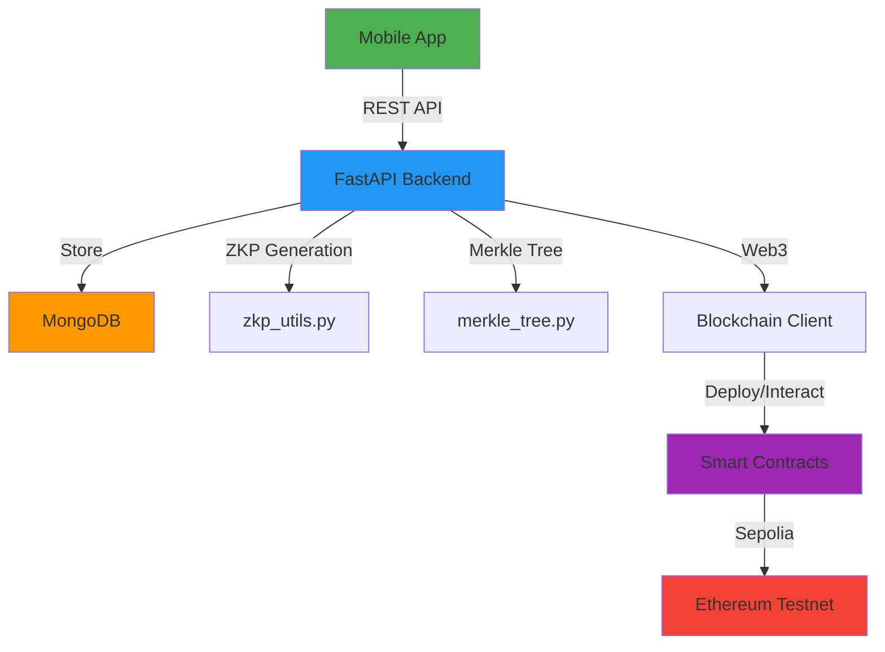

# 🔐 ZK-IoTChain Mobile

A Zero-Knowledge Proof (ZKP) based IoT authentication and data verification system with blockchain integration. This mobile application provides secure device registration, authentication, and data anchoring using cryptographic proofs and Merkle trees.

> ## 🎉 **NEW: Advanced Features Implemented!**
> 
> All 6 major advanced features are now available:
> - ✅ **Multi-Blockchain Support** (Polygon, BSC, Ethereum)
> - ✅ **Enhanced ZKP Schemes** (SNARKs/STARKs foundation)
> - ✅ **Real-Time Monitoring** (WebSocket-based)
> - ✅ **Advanced Analytics** (Comprehensive dashboard)
> - ✅ **Multi-Signature Registration** (Approval workflows)
> - ✅ **Cross-Chain Anchoring** (Multi-chain data integrity)
>
> 📖 **See [ADVANCED_FEATURES.md](./ADVANCED_FEATURES.md) for complete documentation**


## 🌟 Features

### 🔑 Zero-Knowledge Authentication
- Device registration without exposing secrets
- Commitment-based proof system
- Replay attack prevention with timestamp binding
- 5-minute proof validity window
- **NEW**: Enhanced ZKP schemes (SNARKs/STARKs foundation ready)

### 🌳 Merkle Tree Data Anchoring
- Tamper-evident data batching
- Efficient on-chain storage (32 bytes per batch)
- Cryptographic proof generation and verification
- Gas-optimized blockchain operations
- **NEW**: Cross-chain anchoring to multiple blockchains

### 📱 Mobile Application
- Cross-platform (iOS, Android, Web)
- Real-time device management
- Data submission and verification
- System metrics dashboard
- Dark theme UI with responsive design
- **NEW**: Real-time WebSocket monitoring
- **NEW**: Advanced analytics dashboard

### ⛓️ Multi-Blockchain Support
- **Ethereum Sepolia** testnet
- **Polygon Mumbai** testnet & mainnet
- **BSC Testnet** & mainnet
- Network switching capability
- Unified multi-chain API
- Per-network deployment tracking

### 🔐 Advanced Security Features
- Multi-signature device registration
- Proposal-based approval workflow
- Authorized signer management
- Immutable audit trail
- Decentralized verification

## 🏗️ Project Structure

```
zkp_mobile/
├── backend/                    # FastAPI Backend
│   ├── server.py              # Main API server
│   ├── zkp_utils.py           # Zero-Knowledge Proof utilities
│   ├── merkle_tree.py         # Merkle Tree implementation
│   ├── blockchain_client.py   # Web3 client for blockchain
│   ├── proof_models.py        # Type-safe Pydantic models
│   ├── contracts/             # Solidity smart contracts
│   │   ├── DeviceRegistry.sol
│   │   ├── MerkleAnchor.sol
│   │   └── ZKPVerifier.sol
│   ├── scripts/               # Deployment scripts
│   ├── hardhat.config.js      # Hardhat configuration
│   └── requirements.txt       # Python dependencies
│
├── frontend/                   # React Native Mobile App
│   ├── app/
│   │   ├── index.tsx          # Landing screen
│   │   ├── _layout.tsx        # Root layout
│   │   └── (tabs)/            # Tab navigation
│   │       ├── home.tsx       # Dashboard with metrics
│   │       ├── devices.tsx    # Device management
│   │       ├── verify.tsx     # Data verification
│   │       └── profile.tsx    # Settings & profile
│   ├── utils/api.ts           # API client with type safety
│   ├── stores/appStore.ts     # Zustand state management
│   ├── types/proof.ts         # TypeScript type definitions
│   └── package.json           # Dependencies
│
├── tests/                      # Test suite
├── BLOCKCHAIN_SETUP.md        # Blockchain deployment guide
├── MOBILE_APP_SETUP.md        # Mobile app setup guide
└── PROJECT_STATUS.md          # Detailed project status
```

## 🚀 Quick Start

> **🎉 NEW**: All 6 advanced features now implemented! See [ADVANCED_FEATURES.md](./ADVANCED_FEATURES.md) for details.

### Prerequisites

- **Node.js** 18+ and npm/yarn
- **Python** 3.9+
- **MongoDB** (for backend storage)
- **Expo Go** app (for mobile testing)
- **Optional**: Testnet tokens for multi-chain deployment

### Backend Setup

1. **Install Python dependencies:**
   ```bash
   cd backend
   pip install -r requirements.txt
   ```

2. **Install Node.js dependencies:**
   ```bash
   npm install
   # or
   yarn install
   ```

3. **Configure environment variables:**
   Create a `.env` file in the backend directory:
   ```env
   MONGODB_URL=mongodb://localhost:27017
   SEPOLIA_RPC_URL=your_alchemy_or_infura_url
   PRIVATE_KEY=your_private_key_with_sepolia_eth
   ```

4. **Compile smart contracts:**
   ```bash
   npx hardhat compile
   ```

5. **Start the backend server:**
   ```bash
   uvicorn server:app --reload --port 8001
   ```

### Frontend Setup

1. **Install dependencies:**
   ```bash
   cd frontend
   npm install
   # or
   yarn install
   ```

2. **Start Expo development server:**
   ```bash
   npx expo start
   ```

3. **Run on your device:**
   - Press `w` for web browser
   - Press `i` for iOS simulator (macOS only)
   - Press `a` for Android emulator
   - Scan QR code with **Expo Go** app on your phone

## 📡 API Endpoints

### Device Management
| Method | Endpoint | Description |
|--------|----------|-------------|
| `POST` | `/api/devices/register` | Register device with ZKP |
| `POST` | `/api/devices/authenticate` | Authenticate device |
| `GET` | `/api/devices` | List all devices |
| `GET` | `/api/devices/{id}` | Get device details |

### Data Management
| Method | Endpoint | Description |
|--------|----------|-------------|
| `POST` | `/api/devices/data` | Submit IoT data |
| `GET` | `/api/devices/data/pending` | View pending data |

### Merkle Tree Operations
| Method | Endpoint | Description |
|--------|----------|-------------|
| `POST` | `/api/merkle/anchor` | Anchor Merkle root to blockchain |
| `POST` | `/api/merkle/verify` | Verify data integrity |
| `GET` | `/api/merkle/batches` | List all batches |

### Multi-Chain Operations (NEW)
| Method | Endpoint | Description |
|--------|----------|-------------|
| `GET` | `/api/multichain/networks` | List all blockchain networks |
| `POST` | `/api/multichain/switch-network` | Switch active network |
| `GET` | `/api/multichain/network/{name}` | Get network details |
| `POST` | `/api/multichain/devices/register` | Register on multiple chains |

### Real-Time Monitoring (NEW)
| Method | Endpoint | Description |
|--------|----------|-------------|
| `POST` | `/api/realtime/device/{id}/heartbeat` | Report device heartbeat |
| `GET` | `/api/realtime/devices/status` | Get all device statuses |
| `GET` | `/api/realtime/events` | Get recent events |

### Advanced Analytics (NEW)
| Method | Endpoint | Description |
|--------|----------|-------------|
| `GET` | `/api/analytics/overview` | System overview statistics |
| `GET` | `/api/analytics/devices/{id}` | Device-specific analytics |
| `GET` | `/api/analytics/proofs` | ZKP generation metrics |
| `GET` | `/api/analytics/blockchain` | Blockchain statistics |
| `POST` | `/api/analytics/time-series` | Time-series data |
| `GET` | `/api/analytics/export/{type}` | Export data |

### Multi-Signature (NEW)
| Method | Endpoint | Description |
|--------|----------|-------------|
| `POST` | `/api/multisig/propose-registration` | Create registration proposal |
| `POST` | `/api/multisig/approve` | Approve proposal |
| `POST` | `/api/multisig/reject` | Reject proposal |
| `POST` | `/api/multisig/execute/{id}` | Execute approved proposal |
| `GET` | `/api/multisig/proposals` | List all proposals |
| `GET/POST` | `/api/multisig/signers` | Manage signers |

### Cross-Chain (NEW)
| Method | Endpoint | Description |
|--------|----------|-------------|
| `POST` | `/api/cross-chain/anchor` | Anchor to multiple chains |
| `POST` | `/api/cross-chain/verify` | Verify across chains |
| `GET` | `/api/cross-chain/status/{root}` | Get anchor status |
| `GET` | `/api/cross-chain/anchors` | List all anchors |
| `GET` | `/api/cross-chain/sync-status` | Get sync status |

### Enhanced ZKP (NEW)
| Method | Endpoint | Description |
|--------|----------|-------------|
| `GET` | `/api/zkp/schemes` | List supported ZKP schemes |

### Metrics
| Method | Endpoint | Description |
|--------|----------|-------------|
| `GET` | `/api/metrics` | Get system performance metrics |

**Total API Endpoints**: 40+ (15 core + 25 advanced features)

## 🔧 Technology Stack

### Backend
- **FastAPI** - Modern Python web framework
- **Motor** - Async MongoDB driver
- **Web3.py** - Ethereum interaction
- **Hardhat** - Smart contract development
- **Pydantic** - Type-safe data models

### Frontend
- **React Native** - Cross-platform mobile framework
- **Expo** - Development and build tools
- **expo-router** - File-based routing
- **TypeScript** - Type safety
- **Zustand** - State management
- **Axios** - HTTP client
- **WalletConnect** - Wallet integration

### Blockchain
- **Solidity 0.8.20** - Smart contract language
- **Sepolia Testnet** - Ethereum test network
- **Ethers.js** - Web3 library

## 🧪 Testing

### Test Without Blockchain (Off-chain Mode)

You can test core features without deploying contracts:
- ✅ Device registration (ZKP generated off-chain)
- ✅ Device authentication (ZKP verification)
- ✅ Data submission (stored in MongoDB)
- ✅ Merkle tree creation (off-chain)
- ✅ Verification (cryptographic proofs)
- ✅ **NEW**: Real-time monitoring
- ✅ **NEW**: Analytics dashboard
- ✅ **NEW**: Multi-sig proposals

### Test With Blockchain (On-chain Mode)

After deploying contracts, you can test:
- ✅ On-chain device registration
- ✅ Blockchain-verified authentication
- ✅ Merkle root anchoring to Sepolia/Polygon/BSC
- ✅ On-chain data verification
- ✅ Gas metrics tracking
- ✅ **NEW**: Multi-chain deployment
- ✅ **NEW**: Cross-chain anchoring

### Automated Testing

**Quick test all advanced features:**
```powershell
# Windows
cd backend
.\test_advanced_features.ps1

# Linux/Mac
cd backend
chmod +x test_advanced_features.sh
./test_advanced_features.sh
```

**Tests included:**
- Multi-blockchain network operations (3 tests)
- Enhanced ZKP schemes (1 test)
- Real-time device monitoring (3 tests)
- Advanced analytics (3 tests)
- Multi-signature workflows (3 tests)
- Cross-chain operations (2 tests)

**Total**: 15 automated endpoint tests

### Run Smart Contract Tests
```bash
cd backend
npx hardhat test
```

## ⛓️ Blockchain Deployment

### Supported Networks

- **Ethereum Sepolia** (Testnet)
- **Polygon Mumbai** (Testnet) & **Polygon Mainnet**
- **BSC Testnet** & **BSC Mainnet**

### Get Testnet Credentials

1. **For Sepolia/Polygon/BSC:**
   - Sign up for [Alchemy](https://www.alchemy.com/) or [Infura](https://infura.io/)
   - Get network-specific RPC URLs
   - Get testnet tokens from faucets:
     - Sepolia: https://sepoliafaucet.com/
     - Polygon Mumbai: https://faucet.polygon.technology/
     - BSC Testnet: https://testnet.binance.org/faucet-smart

2. **Update `.env` file:**
   ```env
   SEPOLIA_RPC_URL=https://eth-sepolia.g.alchemy.com/v2/YOUR_API_KEY
   POLYGON_MUMBAI_RPC_URL=https://polygon-mumbai.g.alchemy.com/v2/YOUR_API_KEY
   BSC_TESTNET_RPC_URL=https://data-seed-prebsc-1-s1.binance.org:8545
   PRIVATE_KEY=your_private_key_here
   ```

### Deploy to Specific Network

```bash
cd backend

# Deploy to Sepolia
npx hardhat run scripts/deploy.js --network sepolia

# Deploy to Polygon Mumbai
npx hardhat run scripts/deploy.js --network polygonMumbai

# Deploy to BSC Testnet
npx hardhat run scripts/deploy.js --network bscTestnet
```

Each deployment creates a `deployment-{network}.json` file with contract addresses.

### Verify Deployment

After successful deployment:
- Check `deployment-{network}.json` for contract addresses
- Visit network explorer to view contracts
- Test multi-chain API endpoints

For detailed instructions, see [BLOCKCHAIN_SETUP.md](./BLOCKCHAIN_SETUP.md) and [QUICK_START.md](./QUICK_START.md).

## 🔐 Security Features

### Zero-Knowledge Proofs
- **Privacy-preserving**: Device secrets never transmitted
- **Commitment-based**: Cryptographic commitments for verification
- **Replay protection**: Timestamp binding prevents replay attacks
- **Time-limited**: 5-minute proof validity window

### Merkle Trees
- **Tamper-evident**: Any modification invalidates the tree
- **Efficient**: Store only root hash on-chain (32 bytes)
- **Verifiable**: Generate and verify proofs for any data point
- **Batch processing**: Aggregate multiple data points

### Smart Contract Security
- **Access control**: Only authorized devices can register
- **Immutable audit trail**: All operations recorded on blockchain
- **Gas optimization**: Minimal on-chain storage

## 📊 System Architecture



## 📈 Current Status

| Component | Status | Notes |
|-----------|--------|-------|
| Backend API | ✅ Complete | 12+ endpoints, running on port 8001 |
| Mobile App | ✅ Complete | All screens implemented |
| Smart Contracts | ✅ Compiled | Ready for deployment |
| ZKP System | ✅ Complete | Off-chain verification working |
| Merkle Trees | ✅ Complete | Batching and verification working |
| Blockchain | ⏳ Ready | Awaiting credentials for deployment |

## 🤝 Contributing

Contributions are welcome! Please follow these steps:

1. Fork the repository
2. Create a feature branch (`git checkout -b feature/amazing-feature`)
3. Commit your changes (`git commit -m 'Add amazing feature'`)
4. Push to the branch (`git push origin feature/amazing-feature`)
5. Open a Pull Request

## 📝 License

This project is licensed under the MIT License - see the [LICENSE](LICENSE) file for details.

## 👥 Authors

- **Sharan V** - Initial work and development
- **shreyasTalwar** - Contributions

## 🙏 Acknowledgments

- Zero-Knowledge Proof concepts from cryptographic research
- Merkle Tree implementation inspired by blockchain data structures
- React Native community for excellent tools and libraries

## 📚 Additional Documentation

- **[ADVANCED_FEATURES.md](./ADVANCED_FEATURES.md)** - Complete guide to all 6 advanced features
- **[QUICK_START.md](./QUICK_START.md)** - Quick start guide for setup and testing
- **[Mobile App Setup Guide](./MOBILE_APP_SETUP.md)** - Detailed mobile app setup
- **[Blockchain Setup Guide](./BLOCKCHAIN_SETUP.md)** - Smart contract deployment
- **[Project Status](./PROJECT_STATUS.md)** - Detailed project status and capabilities
- **Backend API**: All endpoints documented in `server.py` and `advanced_endpoints.py`
- **Smart Contracts**: See `contracts/*.sol` with inline comments

## 🐛 Known Issues

- Blockchain features require Sepolia testnet deployment
- MetaMask integration needs testing on mobile devices
- Some UI animations may need optimization

## 🔮 Advanced Features (NEW!)

**All advanced features have been implemented!** See [ADVANCED_FEATURES.md](./ADVANCED_FEATURES.md) for detailed documentation.

### ✅ Implemented Features

- [x] **Multi-Blockchain Support** - Deploy to Polygon, BSC, and Ethereum
- [x] **Enhanced ZKP Schemes** - Foundation for SNARKs and STARKs
- [x] **Real-Time Device Monitoring** - WebSocket-based live tracking
- [x] **Advanced Analytics Dashboard** - Comprehensive system metrics
- [x] **Multi-Signature Device Registration** - Approval workflow system
- [x] **Cross-Chain Data Anchoring** - Merkle roots across multiple chains

### 🔮 Future Enhancements

- [ ] Complete SNARK circuit implementation (foundation ready)
- [ ] Frontend mobile UI for all advanced features
- [ ] LayerZero integration for cross-chain messaging
- [ ] Support for additional blockchains (Arbitrum, Optimism, Avalanche)
- [ ] Advanced data visualization in mobile app
- [ ] Real-time push notifications
- [ ] Multi-device dashboard


## 📞 Support

For questions or issues:
- Open an issue on GitHub
- Check existing documentation
- Review the [PROJECT_STATUS.md](./PROJECT_STATUS.md) file

---

**Built with ❤️ using Zero-Knowledge Proofs and Blockchain Technology**
